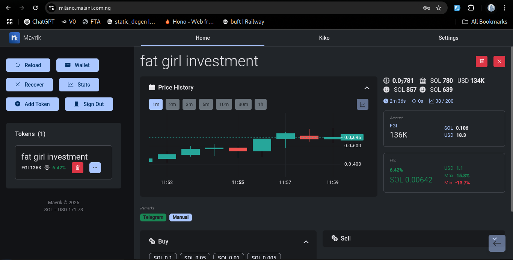

# Miko UI

A high-performance, optimized, real-time Angular Material UI project for Miko.

- It does everything the Telegram Bot UI does except it is real-time, requiring no commands, faster (without the telegram middle connections), offers better user experience, and can be configured to be used at the same time with the Telegram Bot UI.

- Persists user's view preferences, comes in light/dark mode, and offers localization with the ability to easily translate into any preferred language with a single click.

- High-performance, offering faster/real-time trade operations, analysis, configured time-based price deltas, and an interactive candlestick chart.Enabling its user to make decisions and execute them faster, concurrently.

- Optimized to limit data transfers to only needed/mutated information, in real-time with SocketIO. Kiko updates the UI with tiny parts of data which are then reconciled with whole objects in the UI. Also, it streamlines itself across multiple instances (browsers and tabs, clients) while allowing each of the instances to carry out individual actions with results updated across all clients.

- Kiko is enhanced to provide optional configured authentication feature to protect the UI and its SocketIO connections from unauthorized access.

- This project was generated using [Angular CLI](https://github.com/angular/angular-cli) version 19.0.6.

- This was made during my Black Ops so I am yet to actually test it (installed dependencies from local MPM cache, fully simulated its operations, and tackled unusual bugs by scheming, trial and error), will update when I do. My Black Ops is a regular few weeks retreat without a phone or the internet, difficult at first, then it gets okay as I get used to it, then it gets awesome, like I am on steroids. I do not go into the Black Ops with projects in mind, they find me.

- Update: tested, everything works.

